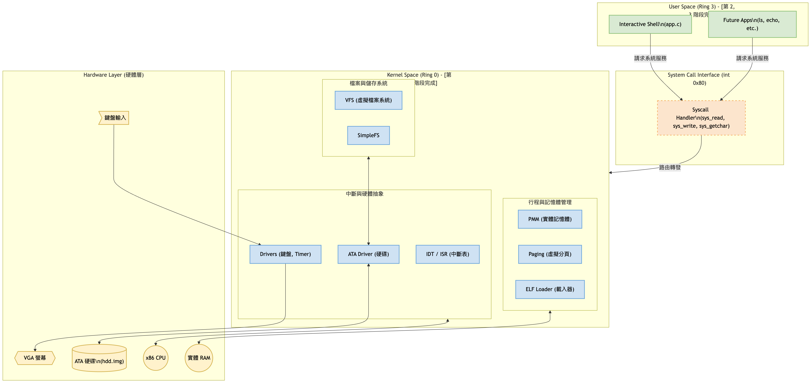
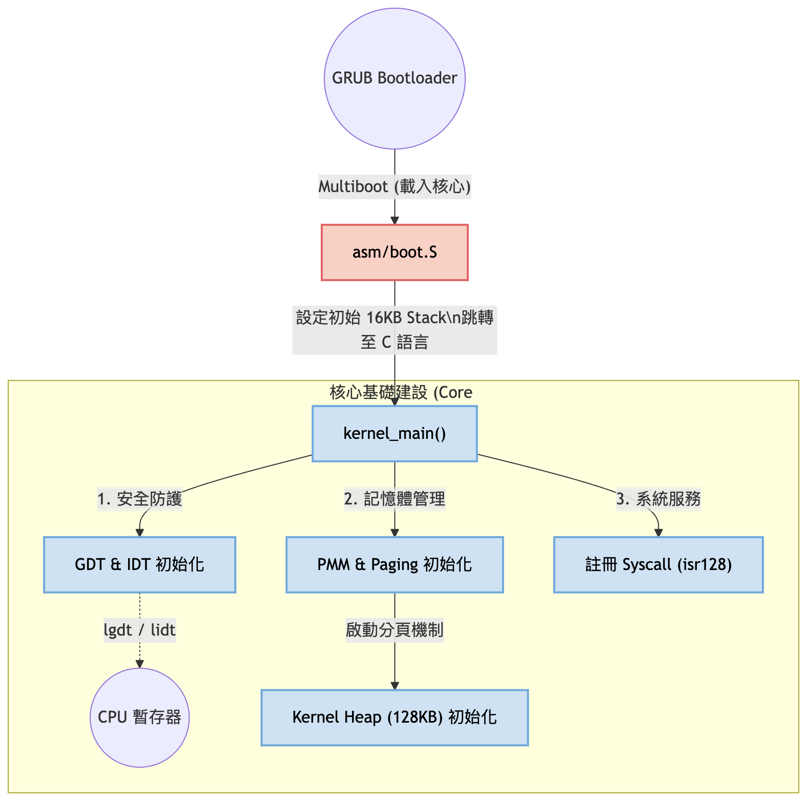
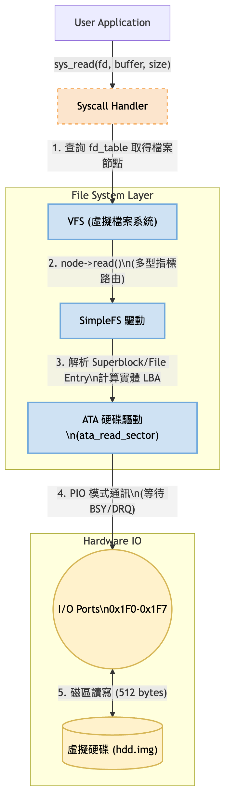
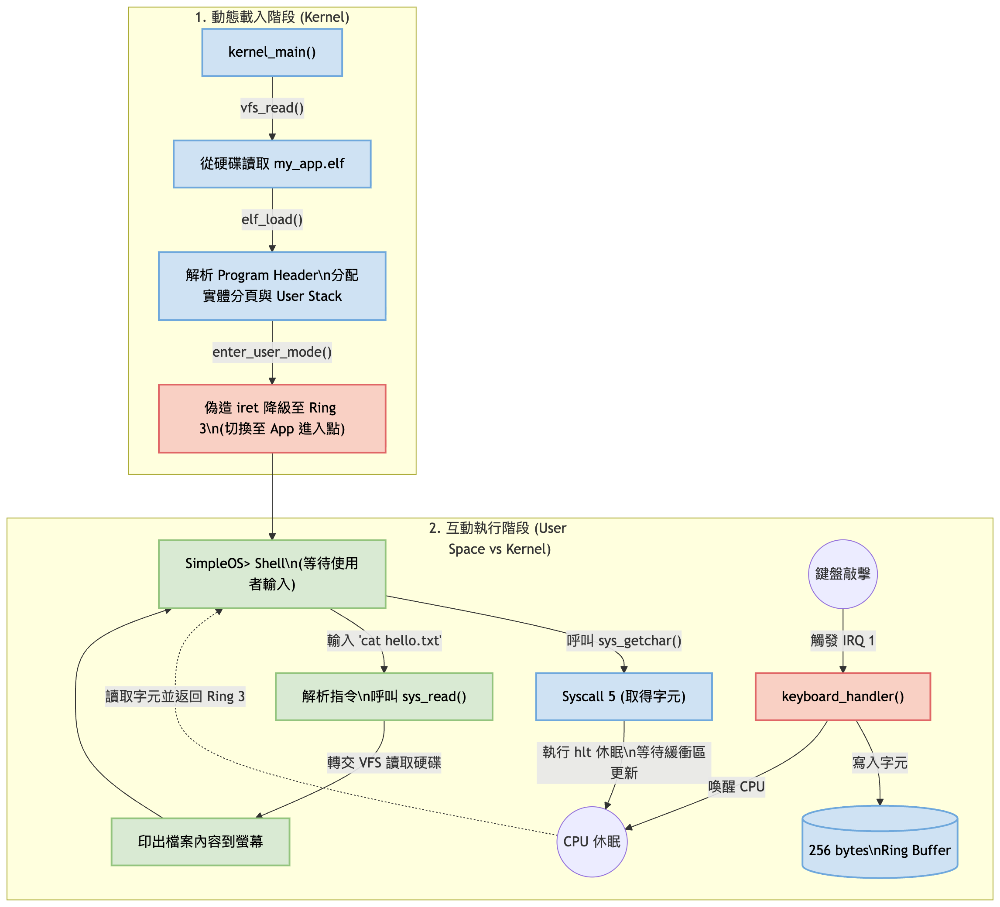
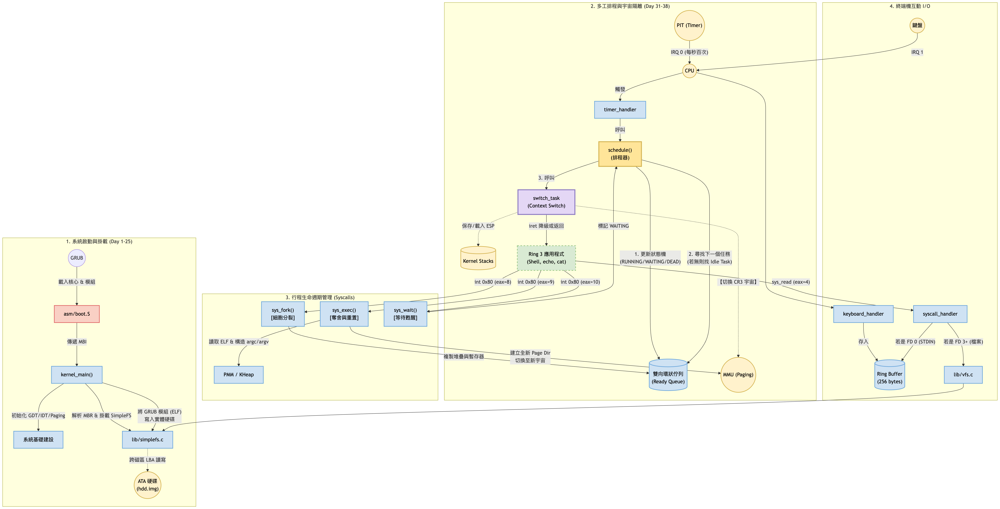

# Prompt

你是一個資訊科學專家，教授 作業系統實作 這門課程，課程內容是教導學生透過實作一個真的可以運作的小型作業系統，透過課程內容學習到作業系統原理。

1. 請你安排一個為期 60 天，每天兩小時的課程內容，同時每次內容都是迭代、且完整的實作，可以輸出成可運行的內容。
2. 這個課程最終的結果將實作出一個小型的作業系統，包含了開機、核心 (Kernel)、具備簡單 Terminal 以及檔案系統、簡單的視窗、以及基本管理工具，像是 ls、top 等。
3. 學生可以透過學習作業系統，了解到檔案系統、開機程序、程序管理、圖形運作、底層驅動、記憶體管理、網路 ... 等概念。

針對上面的需求，你可以再給予建議或者反饋，然後安排課程內容，我每天會安排固定時間，執行上課。

https://gemini.google.com/app/18b8fcafe3a7592b

---

# 課程設計核心原則

* **從零開始 (From Scratch)：** 不依賴標準函式庫 (No standard library)，我們會自己寫 `printf`、`malloc` 等。
* **迭代開發：** 每一階段都要能編譯並在 QEMU 上運行，看到實質的回饋。
* **工具鏈：** 使用 `gcc-cross-compiler`、`nasm`、`ld` (Linker) 與 `make`。

---

# Simple OS 60 天實作課程大綱 (終極更新版)

本專案將 60 天的開發旅程劃分為六個衝刺階段（Sprints）。目前已順利完成前三個階段，系統不僅具備記憶體管理與特權隔離，更成功脫離 Bootloader 依賴，實現了從實體硬碟動態載入執行檔與互動式命令列的現代作業系統雛形。

## 第一階段：啟動與核心骨架 (Day 1-10) [✅ 已完成]

**目標：** 從 BIOS 接管控制權，建立中斷與基礎輸出能力。

* **Day 1-4:** GRUB Multiboot 啟動機制、VGA 文字模式與 `kprint` 基礎輸出實作。
* **Day 5-8:** GDT (全域描述符表)、IDT (中斷描述符表)、ISR 中斷跳板與 PIC 控制器。
* **Day 9-10:** 鍵盤驅動與 Timer (PIT) 基礎中斷處理，完成硬體事件攔截。

## 第二階段：記憶體與特權階級大挪移 (Day 11-20) [✅ 已完成]

**目標：** 建立現代記憶體管理機制，並成功在 Ring 3 執行外部應用程式。

* **Day 11-12:** 任務控制區塊 (TCB) 與基礎 Context Switch (上下文切換)。
* **Day 13-15:** 實體記憶體管理 (PMM)、虛擬記憶體分頁 (Paging)、核心堆積分配器 (`kmalloc`)。
* **Day 16-17:** 系統呼叫 (Syscall, `int 0x80`) 與 TSS 設定，防護降級至 User Mode (Ring 3)。
* **Day 18-20:** ELF 執行檔解析器、GRUB Multiboot 模組接收與虛實記憶體映射。

## 第三階段：儲存裝置、檔案生態與互動 Shell (Day 21-30) [✅ 已完成]

**目標：** 脫離 GRUB 保母，讓系統具備讀取實體硬碟、動態載入應用程式與雙向互動的能力。

* **Day 21-23:** ATA/IDE 硬碟驅動實作 (PIO 模式) 與 MBR 分區表解析。
* **Day 24-27:** VFS (虛擬檔案系統) 路由層設計與 SimpleFS 檔案系統實作 (支援跨磁區讀寫)。
* **Day 28-30:** 檔案描述符 (FD)、User Stack 分配、動態 ELF 載入器，以及結合鍵盤緩衝區的互動式 Simple Shell。

## 第四階段：搶佔式多工與行程管理 (Day 31-40) [🚀 準備展開]

**目標：** 讓系統同時執行多個應用程式，完善行程生命週期管理。

* **Day 31-33:** 搶佔式排程器 (Preemptive Scheduler) 實作，利用 Timer 中斷強行切換多個 Ring 3 行程。
* **Day 34-37:** 實作 UNIX 經典系統呼叫：`fork` (複製行程)、`execve` (替換執行檔)、`exit` 與 `wait`。
* **Day 38-40:** 核心同步機制 (Spinlock, Mutex) 與基礎行程間通訊 (IPC - 匿名 Pipe)。

## 第五階段：User Space 生態擴張與寫入能力 (Day 41-50)

**目標：** 打造平民專用的標準 C 函式庫，並讓檔案系統具備建立與寫入能力。

* **Day 41-43:** 建立 User Space 專屬的標準 C 函式庫 (迷你 libc)，封裝底層 Syscall。
* **Day 44-46:** Ring 3 的動態記憶體分配器 (`malloc`/`free`) 與 `sbrk` 系統呼叫。
* **Day 47-50:** SimpleFS 升級（支援目錄結構與 `sys_write` 寫入硬碟），實作進階指令如 `ls`, `mkdir`, `echo > file`。

## 第六階段：圖形介面與視窗系統 (Day 51-60)

**目標：** 脫離純文字模式，進入高解析度的畫布與視窗世界。

* **Day 51-54:** VBE (VESA BIOS Extensions) 啟動與線性幀緩衝 (Framebuffer) 渲染。
* **Day 55-57:** 滑鼠驅動程式 (PS/2) 實作與基礎圖形引擎開發（畫點、線、矩形）。
* **Day 58-60:** 字體解析渲染與簡單的視窗合成器 (Compositor)，完成 GUI 作業系統雛形。

---

## 課程藍圖

### Overview

### Phase 1 ~ 2

### Phase 3

### Details

---

## 建議與反饋

1. **調試是最大的挑戰：** 在 OS 開發中，你沒有 `gdb` 可以直接連。建議先學會如何使用 QEMU 的偵錯開關（如 `-d int` 查看中斷）以及使用 GDB 遠端連接 QEMU 核心。
2. **不要過度設計：** 在這 60 天內，目標是「理解概念」而非做出「下一個 Linux」。例如：檔案系統選 FAT16 就好，不要挑戰實作實時日誌系統。
3. **關於硬體：** 既然你使用的是 **MacBook Pro M1**，你需要建立一個 x86_64 的 Docker 容器來進行編譯，或者使用虛擬機運行 Linux，因為 macOS 的 Linker 與 Linux 格式 (ELF) 不同。
4. **每天兩小時的分配：**
* **前 30 分鐘：** 閱讀理論（例如：今天要做 IDT，先看 Intel 手冊關於 Interrupts 的章節）。
* **後 90 分鐘：** 實作與 Debug。

---
