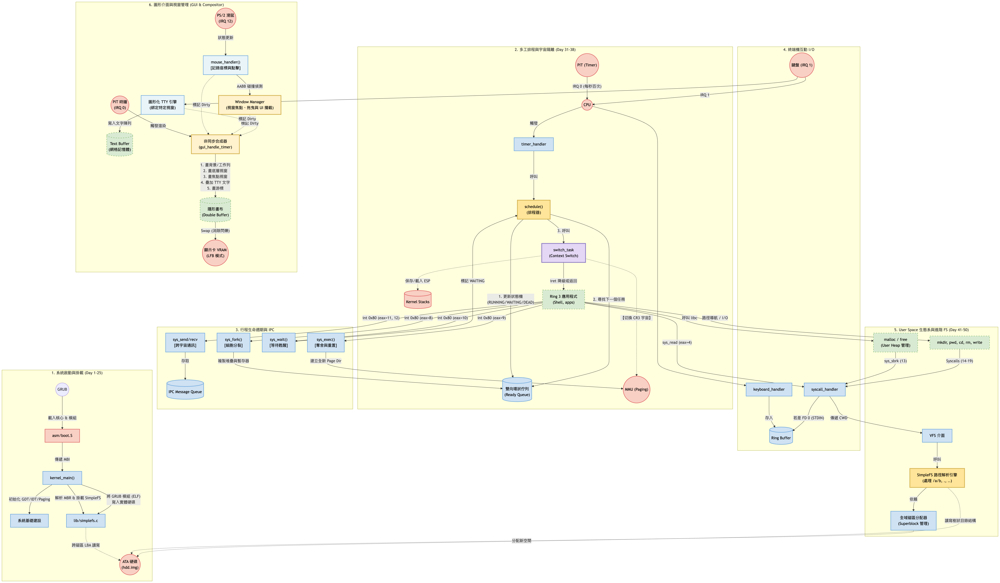

## 課程設計核心原則

* **從零開始 (From Scratch)：** 不依賴標準函式庫 (No standard library)，我們會自己寫 `printf`、`malloc` 等。
* **迭代開發：** 每一階段都要能編譯並在 QEMU 上運行，看到實質的回饋。
* **工具鏈：** 使用 `gcc-cross-compiler`、`nasm`、`ld` (Linker) 與 `make`。

---

# Simple OS 60 天實作課程大綱

本專案將 60 天的開發旅程劃分為六個衝刺階段（Sprints）。

## Phase 1: System Boot & Kernel Infrastructure 

**第一階段**：啟動與核心骨架。
**目標：** 從 BIOS 接管控制權，建立中斷與基礎輸出能力。

* **Day 1-4:** GRUB Multiboot 啟動機制、VGA 文字模式與 `kprint` 基礎輸出實作。
* **Day 5-8:** GDT (全域描述符表)、IDT (中斷描述符表)、ISR 中斷跳板與 PIC 控制器。
* **Day 9-10:** 鍵盤驅動與 Timer (PIT) 基礎中斷處理，完成硬體事件攔截。

## Phase 2: Memory Management & Privilege Isolation

**第二階段**：記憶體與特權階級大挪移。
**目標：** 建立現代記憶體管理機制，並成功在 Ring 3 執行外部應用程式。

* **Day 11-12:** 任務控制區塊 (TCB) 與基礎 Context Switch (上下文切換)。
* **Day 13-15:** 實體記憶體管理 (PMM)、虛擬記憶體分頁 (Paging)、核心堆積分配器 (`kmalloc`)。
* **Day 16-17:** 系統呼叫 (Syscall, `int 0x80`) 與 TSS 設定，防護降級至 User Mode (Ring 3)。
* **Day 18-20:** ELF 執行檔解析器、GRUB Multiboot 模組接收與虛實記憶體映射。

## Phase 3: Storage, File System & Interactive Shell 

**第三階段**：儲存裝置、檔案生態與互動 Shell。
**目標：** 脫離 GRUB 保母，讓系統具備讀取實體硬碟、動態載入應用程式與雙向互動的能力。

* **Day 21-23:** ATA/IDE 硬碟驅動實作 (PIO 模式) 與 MBR 分區表解析。
* **Day 24-27:** VFS (虛擬檔案系統) 路由層設計與 SimpleFS 檔案系統實作 (支援跨磁區讀寫)。
* **Day 28-30:** 檔案描述符 (FD)、User Stack 分配、動態 ELF 載入器，以及結合鍵盤緩衝區的互動式 Simple Shell。

## Phase 4: Preemptive Multitasking & Process Management 

**第四階段**：搶佔式多工與行程管理。
**目標：** 讓系統同時執行多個應用程式，完善行程生命週期管理與記憶體保護。

* **Day 31-33:** 搶佔式排程器 (Preemptive Scheduler) 實作，利用 Timer 中斷強行切換多個 Ring 3 行程，解決無窮迴圈死鎖問題。
* **Day 34-37:** 實作 UNIX 經典系統呼叫：`fork` (複製行程)、`exec` (替換執行檔)、`exit` 與 `wait`，並讓 Shell 具備解析與動態載入外部 ELF 工具的能力。
* **Day 38-40:** 實作 MMU 記憶體隔離 (Memory Isolation) 與跨宇宙的 CR3 切換；建立核心同步機制 (Mutex) 與行程間通訊 (IPC Message Queue)，徹底解決資料競爭與記憶體奪舍問題。

## Phase 5: User Space Ecosystem & Advanced File System 

**第五階段**：User Space 生態擴張與寫入能力。
**目標：** 打造平民專用的標準 C 函式庫，並讓檔案系統具備建立與寫入能力。

* **Day 41-43:** 建立 User Space 專屬的標準 C 函式庫 (迷你 libc)，封裝底層 Syscall。
* **Day 44-46:** Ring 3 的動態記憶體分配器 (`malloc`/`free`) 與 `sbrk` 系統呼叫。
* **Day 47-50:** SimpleFS 升級（支援目錄結構與 `sys_write` 寫入硬碟），實作進階指令如 `ls`, `mkdir`, `echo > file`。

## Phase 6: Graphical User Interface & Window System 

**第六階段**：圖形介面與視窗系統。
**目標：** 脫離純文字模式，進入高解析度的畫布與視窗世界。

* **Day 51-54:** VBE (VESA BIOS Extensions) 啟動與線性幀緩衝 (Framebuffer) 渲染。
* **Day 55-57:** 滑鼠驅動程式 (PS/2) 實作與基礎圖形引擎開發（畫點、線、矩形）。
* **Day 58-60:** 字體解析渲染與簡單的視窗合成器 (Compositor)，完成 GUI 作業系統雛形。

---

## 課程藍圖

---

## 學習環境

1. **調試是最大的挑戰：** 在 OS 開發中，你沒有 `gdb` 可以直接連。建議先學會如何使用 QEMU 的偵錯開關（如 `-d int` 查看中斷）以及使用 GDB 遠端連接 QEMU 核心。
2. **不要過度設計：** 在這 60 天內，目標是「理解概念」而非做出「下一個 Linux」。例如：檔案系統選 FAT16 就好，不要挑戰實作實時日誌系統。
3. **硬體環境：** **MacBook Pro M1**，你需要建立一個 x86_64 的 Docker 容器來進行編譯，或者使用虛擬機運行 Linux，因為 macOS 的 Linker 與 Linux 格式 (ELF) 不同。

---

## 🏆 第二階段 課程大綱 (更新版)

### 🚀 Phase 7：系統引導與行程管理大師 [✅ 已達成]
**成果：完成動態模式切換，建立完善的生命週期與垃圾回收機制。**
* **Day 61-63：** 實作 `grub.cfg` 解析，成功切換 CLI/GUI 模式，並建立包含 PID, PPID 等完整屬性的 PCB (行程控制區塊)。
* **Day 64-65：** 完成 `ps` 與 `top` 指令，成功追蹤 CPU 狀態與動態記憶體 (Heap) 使用量。
* **Day 66-68：** 實作 `sys_kill` 訊號機制、`sys_wait` 收屍機制，並完美解決了孤兒與殭屍行程的記憶體回收問題。

### 🎨 Phase 8：視窗伺服器與真・多工 GUI 生態系 [✅ 超越預期達成]
**成果：打造出具備事件防穿透、拖曳控制，且擁有獨立 SimpleUI 框架的現代桌面環境！**
* **Day 69-70：** 實作 Shared Memory (獨立畫布)，並加入 Page Fault Handler 完美保護 Kernel (Segmentation Fault 防護)。
* **Day 71-72：** 建立精準的 Z-Order 事件路由 (Event Routing) 與點擊穿透防護，實作無縫的視窗拖曳功能。
* **Day 73-74：** 實作 File I/O 與 RTC 系統呼叫，成功打造 `viewer` (BMP 圖片解碼器) 與 `clock` (電子鐘)。
* **Day 75-77：** 實作 GUI IPC 機制，完成 `explorer` (檔案總管支援點擊開啟檔案)、以及 `notepad` (鍵盤事件分發器與打字系統)。
* **Day 78-80：** 實作視窗的四大控制按鈕與工作列狀態，封裝出強大的 `SimpleUI` 元件庫，並開發出 `taskmgr` 與 `tictactoe` (井字遊戲)。

---

### 🌐 Phase 9：網路喚醒：從硬體掃描到 ICMP (大約 10 天) [🔥 即將展開]
**目標：啟動網卡驅動，實作基礎網路堆疊，驗收 `ping` 指令。**
網路是作業系統最龐大、但也最迷人的子系統。我們將由下而上，從實體層一路打通到網路層。

* **Day 81：PCI 匯流排掃描**
    * 掃描主機板上的 PCI 裝置，尋找 QEMU 內建的網路卡 (通常是 RTL8139 或 E1000)。
* **Day 82-83：網卡驅動程式 (NIC Driver) 初始化**
    * 啟動網卡、讀取硬體 MAC 位址、設定 Rx/Tx (接收/發送) Ring Buffer 與 IRQ 中斷。
* **Day 84：乙太網路層 (Ethernet Layer)**
    * 定義乙太網路標頭 (Ethernet Header)，實作 MAC 廣播與 L2 封包收發。
* **Day 85-86：ARP 協定解析**
    * 實作 ARP 請求與回應：網路世界的翻譯蒟蒻 (讓 OS 知道區網內 IP 對應的 MAC)。
* **Day 87：IPv4 協定堆疊**
    * 封裝與解析 IPv4 標頭、Checksum 演算法計算。
* **Day 88-90：ICMP 協定與 `ping` 指令驗收**
    * 實作 ICMP Echo Request / Reply。
    * 開發 User Space 的 `ping.elf`，看著封包成功穿越虛擬機與真實世界，絕對會感動到哭！

---

### 🌍 Phase 10：征服 TCP 協定與 Web 探索 (大約 7 天)
**目標：實作 TCP/UDP，解析 DNS，最終驗收 `wget`。**
有了 IP 之後，我們要實作最困難的 TCP 狀態機，讓 OS 能夠與全世界的 Web Server 溝通。

* **Day 91-92：UDP 與 DNS 解析**
    * 實作 UDP 協定。
    * 開發 DNS Client，輸入網址 (`google.com`) 自動向 8.8.8.8 解析出 IP 網址。
* **Day 93-94：TCP 狀態機與三向交握 (Three-way Handshake)**
    * 網路章節的最終魔王！實作 SYN, SYN-ACK, ACK，以及封包序號 (Sequence Number) 的滑動視窗。
* **Day 95：Socket API 雛形**
    * 提供 Ring 3 應用程式類似 `sys_socket`, `sys_connect`, `sys_send`, `sys_recv` 的系統呼叫。
* **Day 96-97：解析 HTTP 協定與 `wget` 驗收**
    * 組裝 HTTP GET 請求，連上網站下載 HTML 原始碼。
    * 結合 SimpleFS 檔案系統，將下載下來的網頁直接寫入你的虛擬硬碟中！

---
