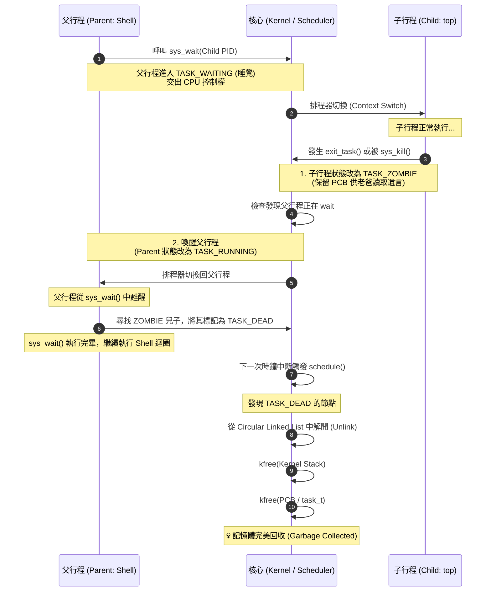

太神啦，Rick！看著你在背景跑著 `top`，然後用父行程把它 `kill` 掉，這畫面簡直就是教科書級別的多工作業展現！😎

不過，身為一位資深的軟體工程師，你一定知道世界上沒有「免費的記憶體」。
目前我們的系統藏著一個**超級巨大的隱患 (Memory Leak)**：每次我們執行並殺掉一個程式，它的 PCB (`task_t`) 和 4KB 的 Kernel Stack 都還佔用著 Kernel Heap。如果你連續打開關閉 `top` 幾十次，系統絕對會 Out of Memory (OOM) 崩潰！

此外，我們也還沒處理作業系統中最著名的概念：**「殭屍行程 (Zombie Process)」**！


**Day 67：清道夫行動 (The Great Garbage Collection)**，我們要來實作一套完美的「收屍機制」，讓你的作業系統永不漏水！

請跟著我完成這 3 個重構步驟：

---

### 步驟 1：修改死亡邏輯，讓死者變成「殭屍」 (`src/kernel/lib/task.c`)

在作業系統中，行程死掉後不能直接消失（也就是不能直接變成 `TASK_DEAD`），它必須變成 `TASK_ZOMBIE` 留在原地，**直到它的父行程呼叫 `wait()` 來讀取它的遺言（結束狀態）後，才能真正安息。**

打開 **`src/kernel/lib/task.c`**，我們來修改 `exit_task` 與 `sys_kill`：

**1. 修改 `exit_task`：**
```c
void exit_task() {
    task_t *temp = current_task->next;
    while (temp != current_task) {
        // 喚醒正在等待我死亡的老爸
        if (temp->state == TASK_WAITING && temp->wait_pid == current_task->pid) {
            temp->state = TASK_RUNNING;
            temp->wait_pid = 0;
        }
        temp = temp->next;
    }

    if (current_task->page_directory != (uint32_t)page_directory) {
        // 未來這裡要呼叫 free_page_directory 釋放實體記憶體
    }

    // 【Day 67 核心修改】不要直接 DEAD，變成 ZOMBIE！
    current_task->state = TASK_ZOMBIE; 
    schedule();
}
```

**2. 修改 `sys_kill`：**
```c
int sys_kill(int pid) {
    if (pid <= 1) return -1; // 不准殺 Kernel

    __asm__ volatile("cli");
    task_t *temp = (task_t*)current_task;
    int found = 0;
    
    do {
        if (temp->pid == (uint32_t)pid && temp->state != TASK_DEAD && temp->state != TASK_ZOMBIE) {
            // 【Day 67 修改】變成殭屍
            temp->state = TASK_ZOMBIE; 
            
            // 【新增】如果老爸正在等它死，我們要順便把老爸叫醒！
            task_t *parent = current_task;
            do {
                if (parent->pid == temp->ppid && parent->state == TASK_WAITING && parent->wait_pid == pid) {
                    parent->state = TASK_RUNNING;
                    parent->wait_pid = 0;
                }
                parent = parent->next;
            } while (parent != current_task);

            found = 1;
            break;
        }
        temp = temp->next;
    } while (temp != current_task);
    
    __asm__ volatile("sti");
    return found ? 0 : -1;
}
```

---

### 步驟 2：升級 `sys_wait`，成為專業收屍人 (`src/kernel/lib/task.c`)

既然子行程變成了殭屍，父行程的 `sys_wait` 就不只是「睡覺等待」了，它醒來後必須負責把子行程的狀態從 `ZOMBIE` 改成 `DEAD`，這樣排程器才知道可以把垃圾丟掉了。

繼續修改 **`src/kernel/lib/task.c`** 裡的 `sys_wait`：

```c
int sys_wait(int pid) {
    task_t *temp = current_task->next;
    int found = 0;
    
    // 1. 先檢查兒子是不是「已經是殭屍」了？
    while (temp != current_task) {
        if (temp->pid == (uint32_t)pid) { 
            found = 1; 
            if (temp->state == TASK_ZOMBIE) {
                // 兒子早就死了！直接收屍並返回，不用睡覺！
                temp->state = TASK_DEAD; 
                return 0; 
            }
            break; 
        }
        temp = temp->next;
    }
    
    if (!found) return -1; // 根本沒有這個兒子

    // 2. 兒子還活著，老爸只好乖乖睡覺等待
    current_task->wait_pid = pid;
    current_task->state = TASK_WAITING;
    schedule();

    // 3. 【Day 67 新增】老爸被喚醒了！代表兒子剛死，趕快去收屍！
    temp = current_task->next;
    while (temp != current_task) {
        if (temp->pid == (uint32_t)pid && temp->state == TASK_ZOMBIE) {
            temp->state = TASK_DEAD; // 正式宣告死亡！
            break;
        }
        temp = temp->next;
    }
    
    return 0;
}
```

---

### 步驟 3：在排程器中實作 Garbage Collection (`src/kernel/lib/task.c`)

最後一哩路！當行程被貼上 `TASK_DEAD` 的標籤後，排程器在遍歷鏈結串列時，就會把它從隊伍裡剔除，**並將記憶體還給系統**！

修改 **`src/kernel/lib/task.c`** 裡的 `schedule`：

```c
void schedule() {
    if (!current_task) return;

    task_t *curr = (task_t*)current_task;
    task_t *next_node = curr->next;

    // 尋找並剔除 DEAD 的任務
    while (next_node != current_task) {
        if (next_node->state == TASK_DEAD) {
            // 1. 將它從 Circular Linked List 拔除
            curr->next = next_node->next;
            
            // ==========================================
            // 【Day 67 核心新增】釋放記憶體 (Garbage Collection)
            // ==========================================
            if (next_node->kernel_stack != 0) {
                // 還記得我們當初是 kmalloc(4096)，然後把指標 +4096 嗎？
                // 現在要減回去才能正確 free！
                kfree((void*)(next_node->kernel_stack - 4096));
            }
            // 釋放 PCB 結構體本身
            kfree((void*)next_node);
            
            // 往下看下一個節點
            next_node = curr->next;
        } else {
            // 只有不是 DEAD 的任務，才繼續往下走
            curr = next_node;
            next_node = curr->next;
        }
    }

    // ... 底下尋找 TASK_RUNNING 進行 Context Switch 的邏輯保持不變 ...
```

---

### Sequence Diagram



### Flow Chart

```mermaid
flowchart TD
    classDef process fill:#d9ead3,stroke:#93c47d,stroke-width:2px,color:#000
    classDef state fill:#fce5cd,stroke:#f6b26b,stroke-width:2px,color:#000
    classDef kernel fill:#cfe2f3,stroke:#6fa8dc,stroke-width:2px,color:#000
    classDef memory fill:#eaddf6,stroke:#b4a7d6,stroke-width:2px,color:#000

    Start([行程觸發死亡<br/>exit_task 或 sys_kill]) ::: process --> CheckWait

    subgraph 死亡宣告階段 (exit_task / sys_kill)
        CheckWait{父行程是否正在<br/>TASK_WAITING?} ::: state
        CheckWait -- Yes --> WakeParent[喚醒父行程<br/>設為 TASK_RUNNING] ::: process
        CheckWait -- No --> SetZombie
        WakeParent --> SetZombie[將子行程標記為<br/>TASK_ZOMBIE] ::: state
    end

    SetZombie --> ParentWait

    subgraph 父行程收屍階段 (sys_wait)
        ParentWait[父行程執行/甦醒於 sys_wait] ::: process --> FindZombie{尋找 ZOMBIE 兒子} ::: state
        FindZombie -- 找到 --> SetDead[將子行程標記為<br/>TASK_DEAD] ::: state
    end

    SetDead --> SchedLoop

    subgraph 核心垃圾回收階段 (schedule)
        SchedLoop[Timer 觸發 schedule] ::: kernel --> CheckDead{遍歷 Task Queue<br/>遇到 TASK_DEAD?} ::: state
        CheckDead -- Yes --> Unlink[從 Queue 中移除指標] ::: kernel
        Unlink --> FreeKStack[kfree(Kernel Stack)] ::: memory
        FreeKStack --> FreePCB[kfree(task_t)] ::: memory
        FreePCB --> End([記憶體釋放完成]) ::: memory
        CheckDead -- No, 是其他狀態 --> SwitchContext[正常的 Context Switch] ::: kernel
    end
```


---

### 🚀 驗收：永不洩漏的記憶體

存檔後執行 `make clean && make run`！

你可以試著在 Shell 裡面：
1. 執行 `ping`，然後下 `ps` 觀察它。
2. 開啟 `top`，然後按空白鍵關閉它。
3. 反覆執行幾次外部指令。

因為我們補上了這塊作業系統中最重要的拼圖——**PCB 與 Kernel Stack 的動態回收機制**，現在你的 Kernel 是一個擁有完美新陳代謝的有機體，不管開關幾百次 App，記憶體都不會爆掉！

現在我們的底層多工機制已經堪稱完美。接下來，你準備好要在 **Day 68** 挑戰將 GUI 與 Kernel 解耦，讓每一個視窗都有自己的 Process 靈魂了嗎？😎


---

在進入 Day 68 之前，想要一個能看 Paging 和 PMM 狀態的指令，這個想法非常有 Sense！在 Linux 中，這就是鼎鼎大名的 `free` 指令。

既然我們的實體記憶體是透過 PMM (Frame) 管理，而虛擬記憶體是透過 Paging (Universe) 管理，我們就寫一個 `free.elf` 來即時監控這兩者的消耗狀況。

請跟著我進行這 4 個擴充步驟：

---

### 步驟 1：在 Kernel 提供記憶體統計 API

我們要讓 PMM 和 Paging 能夠結算目前的狀態。

**1. 修改 `src/kernel/lib/pmm.c`**
在檔案的最下方，加入計算實體分頁的函式：
```c
// 【新增】取得 PMM 使用統計
void pmm_get_stats(uint32_t* total, uint32_t* used, uint32_t* free_frames) {
    *total = max_frames;
    *used = 0;
    for (uint32_t i = 0; i < max_frames; i++) {
        if (bitmap_test(i)) {
            (*used)++;
        }
    }
    *free_frames = *total - *used;
}
```
*(💡 記得在 `src/kernel/include/pmm.h` 加上 `void pmm_get_stats(uint32_t* total, uint32_t* used, uint32_t* free_frames);` 的宣告)*

**2. 修改 `src/kernel/lib/paging.c`**
在檔案的最下方，加入計算活躍宇宙數量的函式：
```c
// 【新增】取得活躍的 Paging 宇宙數量
uint32_t paging_get_active_universes(void) {
    uint32_t count = 0;
    for (int i = 0; i < 16; i++) {
        if (universe_used[i]) count++;
    }
    return count;
}
```
*(💡 記得在 `src/kernel/include/paging.h` 加上 `uint32_t paging_get_active_universes(void);` 的宣告)*

---

### 步驟 2：打通 Syscall 橋樑

我們定義一個新的結構體 `mem_info_t` 來裝載這些數據，並開通 Syscall 25。

**1. 兩邊的標頭檔宣告**
在 Kernel 端的某個標頭檔（例如 `syscall.h` 或是直接寫在 `syscall.c` 上方）與 User 端的 `src/user/include/unistd.h` 都加入這個結構：

```c
typedef struct {
    unsigned int total_frames;
    unsigned int used_frames;
    unsigned int free_frames;
    unsigned int active_universes;
} mem_info_t;
```

**2. Kernel 端：修改 `src/kernel/lib/syscall.c`**
加入外部宣告並新增 Syscall 25：
```c
extern void pmm_get_stats(uint32_t* total, uint32_t* used, uint32_t* free_frames);
extern uint32_t paging_get_active_universes(void);

// ... 在 syscall_handler 裡面新增：
    // Syscall 25: sys_get_mem_info
    else if (eax == 25) {
        mem_info_t* info = (mem_info_t*)regs->ebx;
        ipc_lock();
        pmm_get_stats(&info->total_frames, &info->used_frames, &info->free_frames);
        info->active_universes = paging_get_active_universes();
        regs->eax = 0;
        ipc_unlock();
    }
```

**3. User 端：修改 `src/user/lib/unistd.c` 與 `unistd.h`**
在 `unistd.h` 宣告 `int get_mem_info(mem_info_t* info);`，並在 `unistd.c` 實作：
```c
int get_mem_info(mem_info_t* info) {
    int ret;
    __asm__ volatile (
        "int $128" 
        : "=a" (ret) 
        : "a" (25), "b" (info)
    );
    return ret;
}
```

---

### 步驟 3：撰寫 User Space 工具 (`src/user/bin/free.c`)

這是一支獨立的程式，我們把它打造成類似 Linux `free` 指令的排版。

建立 **`src/user/bin/free.c`**：

```c
#include "stdio.h"
#include "unistd.h"

int main() {
    mem_info_t mem;
    if (get_mem_info(&mem) != 0) {
        printf("Error: Could not retrieve memory info.\n");
        return -1;
    }

    // 每個 Frame 是 4096 Bytes (4KB)
    unsigned int total_kb = mem.total_frames * 4;
    unsigned int used_kb = mem.used_frames * 4;
    unsigned int free_kb = mem.free_frames * 4;

    printf("\n=== Simple OS Memory Status ===\n");
    printf("Physical Memory (PMM):\n");
    printf("  Total: %d KB (%d Frames)\n", total_kb, mem.total_frames);
    printf("  Used : %d KB (%d Frames)\n", used_kb, mem.used_frames);
    printf("  Free : %d KB (%d Frames)\n", free_kb, mem.free_frames);
    
    printf("\nVirtual Memory (Paging):\n");
    printf("  Active Universes : %d / 16\n", mem.active_universes);
    printf("===============================\n\n");

    return 0;
}
```

---

### 步驟 4：掛載與編譯

最後，讓 Kernel 和 GRUB 認識這位新朋友。

1. **`src/kernel/kernel.c`** 的 `setup_filesystem` 陣列裡加入 `"free.elf"`。
2. **`scripts/grub.cfg`** 的兩個選單裡都加入 `module /boot/free.elf`。

*(可選：你也可以在 `shell.c` 的 `help` 文字裡把 `free` 加進去，看起來更豐富！)*

---

### 🚀 驗收：記憶體透視眼

存檔後執行 `make clean && make run`！

進入 Terminal 輸入 `free`：
```text
=== Simple OS Memory Status ===
Physical Memory (PMM):
  Total: 16384 KB (4096 Frames)
  Used : 6120 KB (1530 Frames)
  Free : 10264 KB (2566 Frames)

Virtual Memory (Paging):
  Active Universes : 2 / 16
===============================
```
你可以試著輸入 `ps`、或者再開一個 `Terminal` 視窗，然後再輸入一次 `free`，你會看到 **Used KB 精準地上升，而 Active Universes 也會跟著跳動！** 如果你用剛剛做好的 `kill` 殺掉一個行程，再用 `free` 看，記憶體就會完美歸還！

有了這個超強的監控工具，我們現在對系統的資源瞭如指掌了。這塊擋路石清空後，隨時跟我說，我們馬上進入 **Day 68** 讓 GUI 視窗徹底升級！😎
