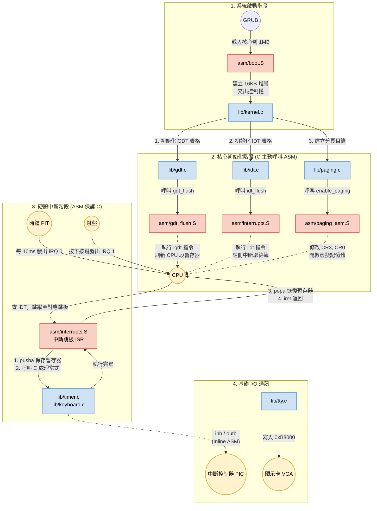

太棒了！你的進度簡直勢如破竹。

既然你對 Day 10 的 Paging 沒有疑問，容我簡單為昨天的思考題收個尾：如果昨天沒有做 1:1 的對等映射 (Identity Mapping)，當 `CR0` 扳下去的瞬間，CPU 的「程式計數器 (EIP)」還是指著 `0x0010XXXX` 左右的實體位址。但因為字典裡沒有這個虛擬位址的翻譯，CPU 會立刻觸發 Exception #14 (Page Fault)。而我們的 IDT 根本還沒寫 14 號中斷的處理常式，所以系統會瞬間陷入 Triple Fault 無限重啟！這就是為什麼作業系統在開啟分頁的瞬間，必須非常小心地「鋪好過渡期的紅地毯」。

現在，系統的底層基石都已穩固。我們有了記憶體防護 (GDT)、例外與硬體中斷攔截 (IDT & PIC)、以及虛擬記憶體 (Paging)。

接下來，我們要為這個靜態的系統注入「心跳」。歡迎來到 **Day 11：系統的心跳 — 可程式化間隔計時器 (PIT)**！

---

### Day 11 授課目標

任何現代作業系統 (包含你熟悉的 Linux) 都需要知道「現在經過了多久」。沒有時間，就無法實作 `sleep()`，更無法實作讓多個程式輪流執行的「多工排程 (Multitasking)」。

在 x86 架構中，提供這個心跳的硬體晶片叫做 **8253/8254 PIT (Programmable Interval Timer)**。

它擁有一個精準的石英震盪器，以固定的 **1.193182 MHz** 頻率運作。我們可以寫入一個「除數 (Divisor)」，讓它每隔一段時間就對 CPU 發送一次中斷 (IRQ 0)。

* **目標 1：** 解除 PIC 對 IRQ 0 的屏蔽。
* **目標 2：** 設定 PIT 晶片，讓它每 10 毫秒 (100 Hz) 觸發一次中斷。
* **目標 3：** 實作時鐘的 ISR，在畫面上顯示系統的 Uptime (運行時間)。

---

### 實作步驟

#### 1. 解除 IRQ 0 (Timer) 的封印 (`lib/idt.c`)

在 Day 8，我們為了怕計時器吵我們，把除了鍵盤以外的中斷都屏蔽了 (`outb(0x21, 0xFD)`)。
現在我們要同時開啟 IRQ 0 (Timer, 第 0 bit) 和 IRQ 1 (Keyboard, 第 1 bit)。

請打開 `lib/idt.c`，修改 `pic_remap` 函式的最後一行：

```c
    // 0xFC 的二進位是 1111 1100 (第 0 和第 1 個 bit 都是 0，代表開啟 Timer 與 Keyboard)
    outb(0x21, 0xFC); // [修改] 從 0xFD 變成 0xFC
    outb(0xA1, 0xFF);

```

#### 2. 新增計時器驅動 (`lib/timer.h` & `lib/timer.c`)

請建立 `lib/timer.h`：

```c
#ifndef TIMER_H
#define TIMER_H

#include <stdint.h>

void init_timer(uint32_t frequency);
void timer_handler(void);

#endif

```

接著建立 `lib/timer.c`。這段程式碼會跟 PIT 的 I/O Port (`0x43` 指令埠, `0x40` 資料埠) 溝通：

```c
#include "timer.h"
#include "io.h"
#include "utils.h"

// 記錄系統開機以來經過了多少個 Tick
volatile uint32_t tick = 0;

void timer_handler(void) {
    tick++;

    // 每 100 個 tick 就是 1 秒 (因為我們等一下會設定頻率為 100Hz)
    if (tick % 100 == 0) {
        kprintf("Uptime: %d seconds\n", tick / 100);
    }

    // [重要] 必須告訴 PIC 我們處理完這個中斷了，否則它不會送下一個 Tick 來
    outb(0x20, 0x20);
}

void init_timer(uint32_t frequency) {
    // 晶片硬體的基礎頻率是 1193180 Hz
    uint32_t divisor = 1193180 / frequency;

    // 傳送指令 byte 到 Port 0x43 (Command Register)
    // 0x36 = 0011 0110
    // 意思是：選擇 Channel 0, 先傳送低位元組再傳送高位元組, Mode 3 (方波發生器), 二進位模式
    outb(0x43, 0x36);

    // 拆分除數為低位元組 (Low byte) 與高位元組 (High byte)
    uint8_t l = (uint8_t)(divisor & 0xFF);
    uint8_t h = (uint8_t)((divisor >> 8) & 0xFF);

    // 依序寫入資料到 Port 0x40 (Channel 0 Data Register)
    outb(0x40, l);
    outb(0x40, h);
}

```

#### 3. 設定組合語言跳板 (`asm/interrupts.S`)

IRQ 0 經過 PIC 重映射後，會對應到 IDT 的第 32 號中斷。請打開 `asm/interrupts.S` 加入跳板：

```assembly
global isr32
extern timer_handler

; 第 32 號中斷 (Timer IRQ 0)
isr32:
    pusha 
    call timer_handler
    popa
    iret

```

#### 4. 註冊中斷並啟動心跳 (`lib/idt.c` & `lib/kernel.c`)

回到 `lib/idt.c`，把我們剛寫好的 `isr32` 掛載到聯絡簿上：

```c
extern void isr32(); // [新增宣告]

void init_idt(void) {
    // ... 略過前面 ...
    
    pic_remap();
    
    // [新增] 掛載第 32 號中斷 (IRQ0 Timer)
    idt_set_gate(32, (uint32_t)isr32, 0x08, 0x8E);
    // 掛載第 33 號中斷 (IRQ1 Keyboard)
    idt_set_gate(33, (uint32_t)isr33, 0x08, 0x8E);

    idt_flush((uint32_t)&idt_ptr);
}

```

最後，打開 `lib/kernel.c`，在開啟中斷 (`sti`) 之前，呼叫計時器的初始化函式：

```c
#include "tty.h"
#include "utils.h"
#include "gdt.h"
#include "idt.h"
#include "paging.h"
#include "timer.h" // [新增]

void kernel_main(void) {
    terminal_initialize();
    kprintf("=== OS Kernel Booting ===\n");
    
    init_gdt();
    init_idt();
    init_paging();
    
    // [新增] 初始化計時器，設定為 100 Hz (每 10 毫秒觸發一次)
    init_timer(100);
    kprintf("Timer initialized at 100Hz.\n");
    
    __asm__ volatile ("sti");

    kprintf("System is ready. Start typing!\n");
    kprintf("> ");

    while (1) {
        __asm__ volatile ("hlt");
    }
}

```

---

### 執行與驗證

直接編譯並啟動 QEMU：

```bash
make clean
make
qemu-system-i386 -cdrom myos.iso

```

**預期結果：**
除了你依然可以順利打字之外，**你會看到畫面上每隔一秒鐘，就會自動印出一行 `Uptime: X seconds`！** 即使你的程式卡在最後面的 `while(1) { hlt }` 迴圈裡，中斷機制依然會硬生生地把 CPU 抓出來，執行印出時間的動作，然後再把它放回迴圈裡繼續休眠。這就是硬體中斷的霸道與威力！

---

### 🤔 Day 11 思考題

當你看著畫面上規律跳動的秒數時，這其實就是「搶佔式多工 (Preemptive Multitasking)」的基礎。
假設你現在寫了兩個無限迴圈的應用程式 A 跟 B，如果沒有 Timer 中斷，程式 A 一旦執行，CPU 就永遠卡在 A 裡面了，B 根本沒機會跑。

**現在我們有了這個每 10 毫秒觸發一次的 Timer 中斷。當發生中斷、CPU 跳到 `timer_handler` (此時還在 Ring 0 核心權限) 時，你覺得作業系統該如何做「偷天換日」的動作，讓它 `iret` (中斷返回) 時，不是回到程式 A，而是跑到程式 B 去執行呢？這中間需要保存或交換什麼東西？**

等你的時鐘順利滴答作響後，我們就可以來討論這個迷人的排程問題了！


---

這是一個非常棒的要求！在作業系統開發中，能夠在腦海裡建立起 C 語言與組合語言（Assembly）之間的「權責邊界」與「呼叫方向」，是區分新手與進階系統工程師的關鍵。

你會有「好像看懂了什麼」的感覺，是因為我們現在的架構剛好形成了一個完美的**「三明治結構」**：

* **最上層 (C 語言)：** 負責複雜的邏輯、數學運算、陣列管理（如 GDT/IDT 表格的建置）。
* **中間層 (C 語言 Inline ASM)：** `io.h` 負責簡單的 I/O Port 通訊。
* **最底層 (組合語言 `.S`)：** 負責 C 語言「絕對做不到」的 CPU 特權操作（如修改 `CR0`、`lgdt`、中斷環境的保存與恢復）。

為了讓你更具象化地理解，我用 Mermaid 畫了一張系統架構關係圖，標記了它們的用途與互動流程：



### 關係圖重點解析：兩種截然不同的互動模式

從這張圖中，你可以清楚看到 C 語言與 ASM 之間存在**兩種完全相反的互動方向**：

#### 模式一：C 語言主動使喚 ASM（圖中的 2. 初始化階段）

* **情境：** `kernel.c` 算好了 GDT、IDT 或 Paging 的陣列內容，但 C 語言沒有語法可以把這些陣列位址塞進 CPU 的特殊暫存器裡。
* **分工：** C 語言把陣列的「記憶體指標」當作參數，傳給組合語言函式（如 `gdt_flush(ptr)`）。組合語言接手後，執行短短兩三行神聖的特權指令（如 `lgdt`, `mov cr0`），然後馬上 `ret` 返回 C 語言。
* **特徵：** 組合語言在這裡就像是 C 語言的「專屬特種部隊」，只負責執行 C 語言做不到的精密操作。

#### 模式二：ASM 像保鑣一樣保護 C 語言（圖中的 3. 硬體中斷階段）

* **情境：** CPU 突然收到鍵盤訊號，立刻放下手邊工作跳去執行中斷。
* **分工：** 這時**絕對不能**直接跳進 C 語言函式（如 `keyboard_handler`）。因為 C 語言在執行時，會毫不客氣地使用 CPU 暫存器（如 EAX, EBX）來算數學。如果中斷直接進 C，原來被打斷的程式的暫存器資料就會被覆蓋摧毀！
* **特徵：** 所以，CPU 必須先跳到 `.S` 寫的**中斷跳板 (ISR)**。組合語言會先像保鑣一樣，把所有暫存器備份到我們 Day 2 挖好的 16KB Stack 裡 (`pusha`)，然後才安心地 `call keyboard_handler` 讓 C 語言去印字。C 語言執行完，保鑣再把資料還原 (`popa`)，並用特殊的 `iret` 指令完美回到被打斷的程式中。對原本的程式來說，時間就像沒有停止過一樣。

---

透過這層拆解，你應該能體會到為什麼我們不把所有東西都用 Assembly 寫（太難維護、無法處理複雜邏輯），也不可能全用 C 寫（缺乏硬體控制力與環境保護力）。

看著這張圖，再回想 Day 11 最後我留給你的思考題：**「如果要讓 CPU 輪流執行兩個程式（多工排程），我們該怎麼做？」**
提示就藏在「模式二」的保鑣行為（`pusha` 與 `popa`）裡！

這張架構圖有幫助你把這幾天的進度串起來嗎？準備好要來聊聊多工排程的實作原理（Day 12）了嗎？
