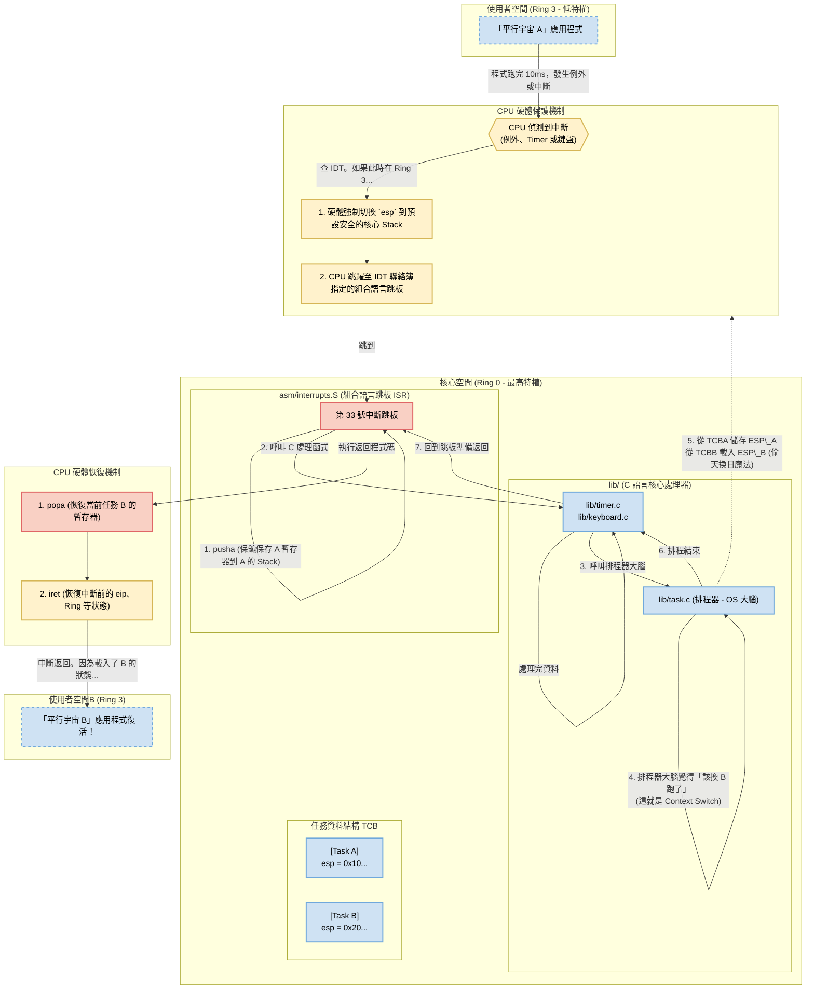

### Simple OS 多工排程 (Task Switch) 終極流程圖

這張流程圖整合了我們昨天搬家後的 `lib/`、`asm/` 架構，以及你要求加入的 Ring 特權級別與 ISR 跳板邏輯。

這張圖完美呈現了 CPU 是怎麼在中斷發生時從 Ring 3 換到安全的核心 Stack (Ring 0 ISR)，保存舊任務狀態，排程器介入「偷天換日」載入新任務 Stack Pointer，最後 `iret` 完美復活另一個宇宙的過程。

現在系統的骨架都已經模組化得很漂亮了，你也掌握了系統的核心名詞清單。

**準備好迎接下一個挑戰嗎？我們下一次就要來處理實作中「超級大魔王關卡」 —— Day 13 的「記憶體分頁管理 (Paging) 的進階應用：核心映射」囉！** 這可是系統能做到「多工處理」與「記憶體隔離」的核心魔法。
