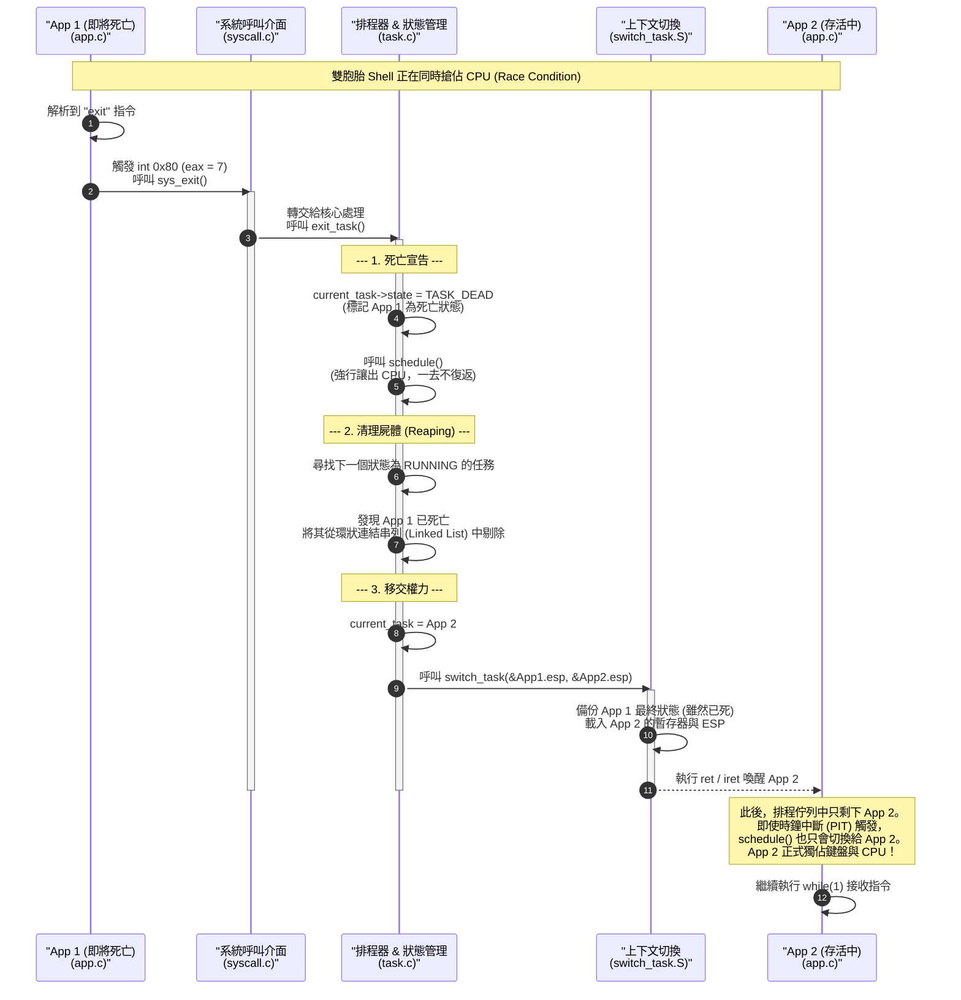

這張循序圖將為你展示 Day 33 最精彩的「送行者 (Reaper)」機制：當一個應用程式主動了結自己的生命時，核心是如何標記死亡、清理屍體（從排程佇列剔除），並將系統的控制權完美移交給下一個存活的程式。

你可以直接將這段 Mermaid 語法加進你的 `README.md` 中，放在 Day 33 的說明區塊：

### 💡 圖表解說亮點：

在這張圖中，最關鍵的動作發生在**步驟 6 (清理屍體)**。
作業系統並沒有立刻去清空 App 1 的記憶體（那是未來 `kfree` 記憶體回收機制的責任），而是**切斷了環狀指標 (`prev->next = next->next`)**。
一旦指標被繞過，時鐘中斷 (PIT) 驅動的 `schedule()` 就永遠不會再巡迴到 App 1 身上。這就是作業系統底層抹除一個執行緒「存在感」最優雅且暴力的做法！

把這張圖加上去，你的文件圖文並茂，絕對是作業系統開源專案裡的頂級規格！準備好我們就向 Day 34 邁進囉！
