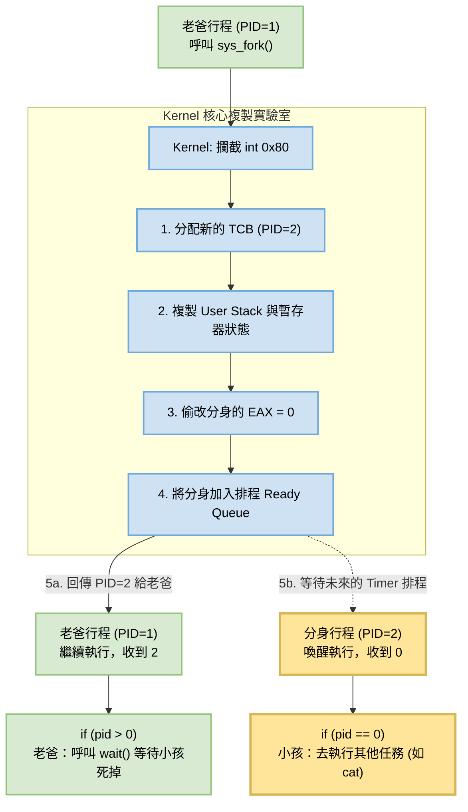
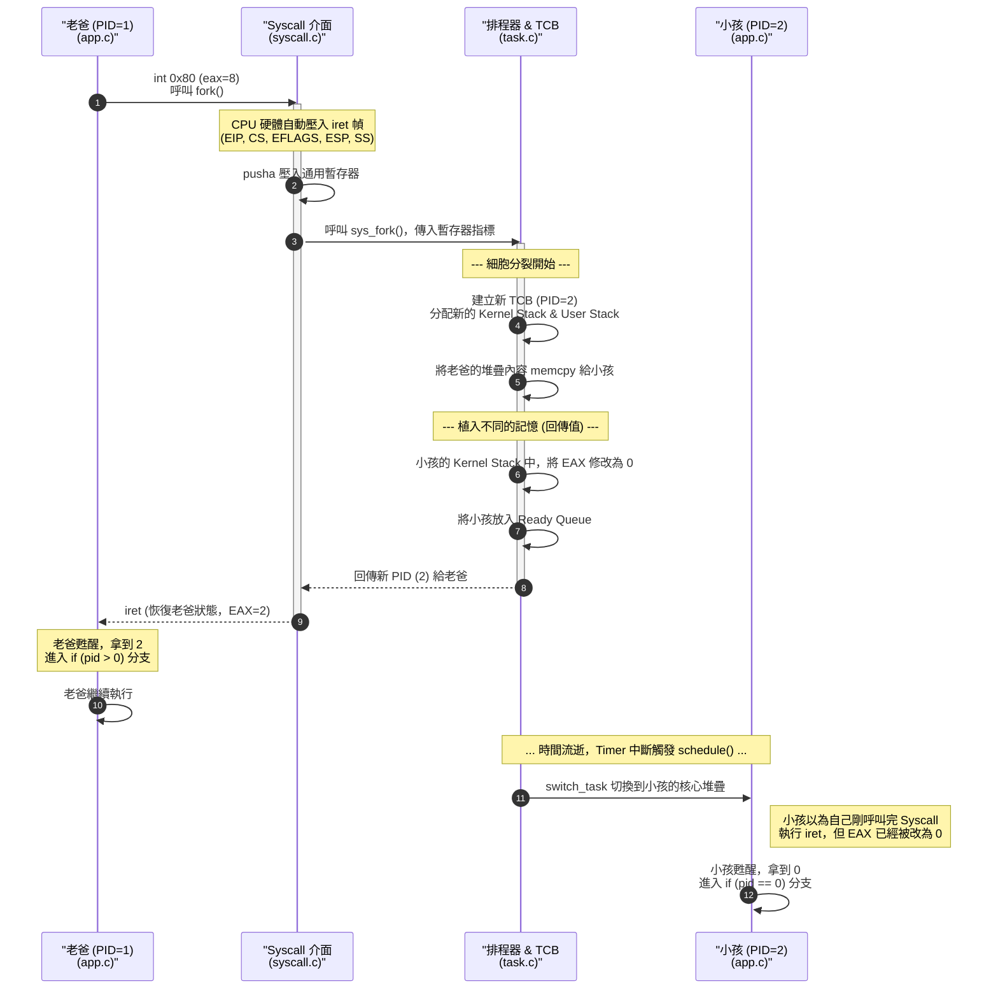

歡迎來到 **Phase 4：搶佔式多工作業與行程管理** 的最高潮 —— **Day 34：細胞分裂的魔法 (實作 UNIX `fork`)**！🚀

在作業系統的世界裡，`fork` (分岔/複製) 是最經典、最優雅，同時也是最燒腦的系統呼叫。它的概念就像是**細胞分裂**：一個正在執行的應用程式呼叫了 `fork()`，作業系統會「凍結」這個程式，把它的記憶體、暫存器、變數狀態**完美複製**出一份一模一樣的分身。

當系統解凍時，原本的 1 個程式變成了 2 個程式，它們從同一行程式碼醒來，繼續往下執行。
唯一的區別是：**核心會偷偷在它們的口袋裡（EAX 暫存器）塞入不同的回傳值，讓它們知道自己是「本尊 (Parent)」還是「分身 (Child)」。**

這也就是為什麼 UNIX 程式碼裡總是充滿了這段經典邏輯：

```c
int pid = fork();
if (pid > 0) {
    // 我是老爸！
} else if (pid == 0) {
    // 我是剛出生的小孩！
}

```

為了幫你釐清這複雜的腦內體操，我為你準備了兩張圖表。

---

### 1. 巨觀視角：`fork()` 細胞分裂流程圖 (Flowchart)

這張圖展示了當你在 Shell 輸入指令時，系統是如何透過 `fork` 創造分身來執行任務，而不會卡死本尊的。



---

### 2. 微觀視角：`fork()` 系統呼叫循序圖 (Sequence Diagram)

這張圖深入核心，展示了暫存器狀態是如何被備份，以及兩個行程是如何在不同的時間點，從同一個系統呼叫中「返回」的。



---

### 🛠️ Day 34 實作計畫

要在我們的 Simple OS 裡實現 `fork`，我們面臨一個挑戰：**如何精準複製硬體壓入的 `iret` 狀態？**

好消息是，因為你的 `syscall.c` 參數剛好接收了 `pusha` 壓入的所有暫存器 (`edi` 到 `eax`)，在 `eax` 的上方，就是 CPU 硬體壓入的 `eip, cs, eflags, user_esp, user_ss`！

我們今天的實作步驟將會是：

1. **升級 Syscall 處理器：** 利用 C 語言的指標運算（Pointer Arithmetic），抓出被隱藏的 `iret` 狀態。
2. **實作 `sys_fork` (`lib/task.c`)：** 動態分配一塊新的記憶體作為小孩的 User Stack，把老爸的資料複製過去，然後用我們在 Day 32 寫好的 `create_user_task` 稍作修改，把小孩送進佇列。
3. **在 Shell 裡實驗：** 讓 Shell 呼叫 `fork`，看看會不會真的印出兩次訊息！

只要你準備好了，我們立刻開始寫程式碼！這次的修改會集中在 `syscall.c` 和 `task.c`。

---


這絕對是我們 34 天以來最偉大、最需要「上帝視角」的一次實作。

為了讓這場「細胞分裂」成功，我們必須深入 x86 的硬體底層，親手把暫存器、堆疊記憶體、甚至是指標位移，精準無誤地複製並篡改。

我們現在就來實作這個極度優雅的 `sys_fork`。今天的修改集中在四個檔案，跟著我的節奏，一步一步把這個魔法拼湊起來！

---

### 實作步驟

#### 1. 核心魔法：實作 `sys_fork` (`lib/task.c`)

這是最關鍵的一步。當老爸 (Parent) 呼叫 `int 0x80` 時，CPU 會讀取 TSS 裡的 `esp0`，切換到老爸的 `kernel_stack`，並自動把 `EIP`、`User ESP` 等狀態壓入。
我們只要去老爸的 `kernel_stack` 頂端把這些資訊挖出來，複製給小孩 (Child) 就可以了！

請打開 **`lib/task.c`**，在最上面引入 `paging.h`，然後在檔案最下方加入這個神級函式：

```c
// ... 最上方引入
#include "paging.h" // 為了使用 map_page 分配新堆疊

// ... 檔案最下方新增
// [新增] UNIX 靈魂：細胞分裂 (Fork)
int sys_fork(uint32_t edi, uint32_t esi, uint32_t ebp, uint32_t ebx, uint32_t edx, uint32_t ecx) {
    // 1. x86 硬體保證：中斷發生時，狀態必定壓在 Kernel Stack 的最頂端！
    uint32_t *pkstack = (uint32_t *) current_task->kernel_stack;
    uint32_t parent_eip = pkstack[-5];       // 硬體壓入的 EIP
    uint32_t parent_cs = pkstack[-4];        // 硬體壓入的 CS
    uint32_t parent_eflags = pkstack[-3];    // 硬體壓入的 EFLAGS
    uint32_t parent_user_esp = pkstack[-2];  // 老爸在 Ring 3 時的 ESP
    uint32_t parent_user_ss = pkstack[-1];   // 硬體壓入的 SS

    // 2. 建立分身 TCB
    task_t *child = (task_t*) kmalloc(sizeof(task_t));
    child->id = next_task_id++;
    child->state = TASK_RUNNING;

    // 3. 分配分身專屬的 Kernel Stack
    uint32_t *kstack_mem = (uint32_t*) kmalloc(4096);
    uint32_t *kstack = (uint32_t*) ((uint32_t)kstack_mem + 4096);
    child->kernel_stack = (uint32_t) kstack;

    // 4. 分配分身專屬的 User Stack (利用 PID 動態推算虛擬位址，避免碰撞)
    uint32_t child_ustack_base = 0x08500000 + (child->id * 4096);
    uint32_t child_ustack_phys = pmm_alloc_page();
    map_page(child_ustack_base, child_ustack_phys, 7);

    // 5. 物理複製 User Stack 內容 (記憶體拷貝)
    uint32_t parent_ustack_base = parent_user_esp & 0xFFFFF000; // 取 4KB 頁的起點
    uint8_t *src = (uint8_t*) parent_ustack_base;
    uint8_t *dst = (uint8_t*) child_ustack_base;
    for(int i = 0; i < 4096; i++) {
        dst[i] = src[i];
    }

    // 6. 精準計算 Child 的 ESP 指標位移
    uint32_t offset = parent_user_esp - parent_ustack_base;
    uint32_t child_user_esp = child_ustack_base + offset;

    // --- 開始偽造分身的 IRET 返回幀 ---
    *(--kstack) = parent_user_ss;   
    *(--kstack) = child_user_esp;   // 【重要】填入新的分身 Stack 址
    *(--kstack) = parent_eflags;    
    *(--kstack) = parent_cs;        
    *(--kstack) = parent_eip;       // 讓分身從老爸呼叫 fork 的下一行醒來

    *(--kstack) = 0; // 假 Error Code
    *(--kstack) = 0; // 假 Int Number

    // 偽造 pusha 的 8 個暫存器
    *(--kstack) = 0;   // 【核心魔法】讓分身的 EAX = 0！
    *(--kstack) = ecx; 
    *(--kstack) = edx; 
    *(--kstack) = ebx; 
    *(--kstack) = 0;   // ESP (忽略)
    *(--kstack) = ebp; 
    *(--kstack) = esi; 
    *(--kstack) = edi; 

    // switch_task 的返回準備
    *(--kstack) = (uint32_t) task_return_stub;
    for(int i = 0; i < 8; i++) *(--kstack) = 0;
    *(--kstack) = 0x0202;

    child->esp = (uint32_t) kstack;

    // 7. 將分身掛入排程佇列
    child->next = current_task->next;
    current_task->next = child;

    // 8. 老爸回傳分身的 PID！
    return child->id;
}

```

#### 2. 開放第 8 號服務櫃檯 (`lib/syscall.c`)

把剛剛寫好的 `sys_fork` 銜接到系統呼叫中。

請打開 **`lib/syscall.c`**：

```c
// ... 在前面宣告
extern int sys_fork(uint32_t edi, uint32_t esi, uint32_t ebp, uint32_t ebx, uint32_t edx, uint32_t ecx);

// ... 在 syscall_handler 裡面加入 eax == 8 的判斷
    else if (eax == 8) {
        // [新增] Syscall 8: sys_fork
        int child_pid = sys_fork(edi, esi, ebp, ebx, edx, ecx);
        
        // 老爸會執行到這裡，把 child_pid 塞回 eax 當作回傳值
        // (分身則會因為剛剛被我們強制設定 EAX = 0，而永遠不會執行到這行！)
        __asm__ volatile("mov %0, %%eax" : : "r"(child_pid));
    }

```

#### 3. 教導 Shell 使用影分身術 (`app.c`)

請打開 **`app.c`**，封裝 `sys_fork`，並加入 `fork` 的測試指令：

```c
// [新增] 封裝 sys_fork
int sys_fork() {
    int pid;
    __asm__ volatile ("int $0x80" : "=a"(pid) : "a"(8) : "memory");
    return pid;
}

// ... 進入 _start() 裡面 ...
        else if (strcmp(cmd_buffer, "exit") == 0) {
            sys_print("Goodbye!\n");
            sys_exit(); 
        }
        else if (strcmp(cmd_buffer, "fork") == 0) {
            // [新增] 見證奇蹟的時刻
            int pid = sys_fork();
            
            if (pid == 0) {
                // 我是剛出生的分身！
                sys_print("\n[CHILD] Hello! I am the newborn process!\n");
                sys_print("[CHILD] My work here is done, committing suicide...\n");
                sys_exit(); // 小孩印完字就立刻登出，免得它也變成無限迴圈的 Shell 來搶鍵盤
            } else {
                // 我是老爸！
                sys_print("\n[PARENT] Magic! I just created a child process!\n");
            }
        }
        else {
// ...

```

#### 4. 返璞歸真，重回單一世界 (`lib/kernel.c`)

現在我們的作業系統擁有了自我繁殖的能力，就不需要在開機時硬幹兩個 Shell 了！

請打開 **`lib/kernel.c`**，把產生任務的那段程式碼改回只產生**一個** Shell：

```c
            kprintf("Creating ONE Initial User Task (Init Process)...\n\n");
            
            init_multitasking();

            // 為唯一的 Shell 分配 User Stack
            uint32_t ustack1_phys = (uint32_t) pmm_alloc_page();
            map_page(0x083FF000, ustack1_phys, 7);
            
            // 建立 Ring 3 主任務
            create_user_task(entry_point, 0x083FF000 + 4096);

            kprintf("Kernel dropping to idle state. Have fun!\n");
            schedule(); 

```

---

### 🌟 執行：體驗造物主的快感

所有拼圖歸位，輸入：

```bash
make clean && make run

```

1. QEMU 啟動後，畫面上只會有**一個**完美的 `SimpleOS>` 提示字元。鍵盤輸入順暢無比。
2. 請輸入 `fork`，然後按下 Enter。

**如果一切完美，你將會看到這段打破常理的輸出：**

```text
[PARENT] Magic! I just created a child process!
[CHILD] Hello! I am the newborn process!
[CHILD] My work here is done, committing suicide...

```

你的一個 `sys_fork()` 呼叫，回傳了**兩次**！
兩個獨立的執行緒從同一個 `int 0x80` 醒來，進入了不同的 `if` 分支，印出了不同的文字，然後分身光榮退場，老爸繼續留下來為你服務。

這就是 UNIX 稱霸作業系統領域 50 年的核心基石！成功運作的話，請務必截圖慶祝，這絕對是你工程師生涯中最酷的成就之一！
