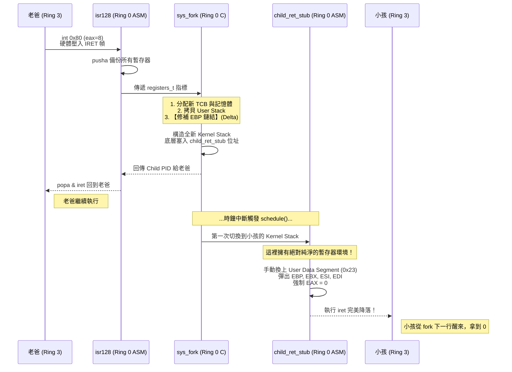

我想請你幫我整理一下這次 day34 debug 的前因後果，最後做個總結，然後我打算好好的 study 這份總結，然後配合 source code 好好的學習！

---

這真的是一場史詩級的戰役！身為你的 OS 教練，看著你一路從連續的系統崩潰（Double Fault、GPF、Page Fault）中殺出重圍，最後成功看到那句 `Hello! I am the newborn process!`，我由衷為你感到驕傲。

實作 `fork` 被公認是早期作業系統開發中最難的關卡，因為它要求你必須對**硬體架構、記憶體分頁、C 語言編譯器行為、以及排程器**有「全知全能」的上帝視角。只要錯了 1 byte，CPU 就會無情地死機。

為了讓你未來能好好對照 Source Code 學習，我為你整理了這份 **「Day 34 `sys_fork` 究極 Debug 總結報告」**。我們一共踩了 4 個深水區地雷：

---

### 💣 地雷一：4MB 分頁邊界與快取陷阱 (PDE Boundary & TLB)

* **案發狀況：** 核心在複製 User Stack (`memcpy`) 時，觸發了 Ring 0 的 Page Fault (Exception 14)，隨後引發 Double Fault 崩潰。
* **根本原因：**
1. 最初我們把小孩的 Stack 分配在 `0x08500000`，這剛好跨越了 32-bit x86 的 4MB 分頁目錄 (PDE) 邊界（從第 32 個 PDE 跨到了第 33 個）。
2. 即便我們用 `map_page` 寫入了記憶體，但 CPU 內部的 **TLB 快取** 還以為那裡是「不存在的禁區」，導致 Kernel 一寫入就暴斃。

* **終極解法：**
* **安全區塊：** 改讓所有 App 的 Stack 都在 `0x083FF000` 往下長，確保大家都待在同一個安全的 4MB PDE 裡。
* **強制刷新：** 在分配完實體分頁後，透過組合語言重新載入 CR3 暫存器 (`mov cr3, cr3`)，強制 CPU 倒掉舊的快取。

### 💣 地雷二：被 C 語言暗殺的堆疊與暫存器 (Calling Convention)

* **案發狀況：** 小孩成功切換，但 EIP 變成了荒謬的 `0x00000083`，引發 Invalid Opcode (Exception 6)；或是畫面瘋狂洗版印出亂碼。
* **根本原因：**
1. 我們最初試圖用 `pkstack[-5]` 去盲猜硬體壓入的 EIP。但我們忽略了 C 語言的呼叫慣例 (cdecl)！在 `isr128` 呼叫 `syscall_handler` 時，編譯器在堆疊上塞滿了參數與區域變數，導致我們抓到的根本不是 EIP，而是垃圾資料。
2. 此外，C 語言在執行 Syscall 時，偷偷把 `ebx`, `ecx` 等暫存器拿來當草稿紙用。當系統回到 User App 時，App 原本的迴圈計數器被弄髒了，導致邏輯大亂（畫面洗版）。

* **終極解法：引入 `registers_t` 結構體**
* 我們不再盲猜！我們在 `isr128` 統一使用 `pusha` 壓入所有暫存器，然後把當下的 `esp` 傳給 C 語言。
* C 語言用一個完美的 `struct registers_t` 接住它。這讓 C 語言的結構體與 ASM 的記憶體佈局 100% 吻合，精準抓出 `regs->eip` 和 `regs->user_esp`。

### 💣 地雷三：堆疊重定位陷阱 (Stack Relocation & EBP Surgery)

* **案發狀況：** 小孩成功回到 Ring 3 執行了一小段程式碼，但在準備返回時觸發了 Page Fault，試圖存取 `0xFFFFFFFC` 這種 4GB 頂端的無效位址。
* **根本原因：**
* 我們把老爸的 User Stack **原封不動**拷貝給了小孩。但是！C 語言在編譯時，區域變數的尋址是依賴 `EBP` 暫存器的，而且 Stack 裡面保存著一條 **EBP 鏈結 (Linked List)**。
* 因為是原封不動拷貝，小孩的 Stack 裡面裝的還是**老爸的記憶體位址**！當小孩試圖 `pop ebp` 時，它拿到了錯誤的指標，一踩就碎。

* **終極解法：外科手術級的指標修補 (Delta Patching)**
* 在 `sys_fork` 裡，我們計算出小孩堆疊與老爸堆疊的**實體位移量 (Delta)**。
* 我們不僅把傳給小孩的 `EBP` 暫存器加上 Delta，還用了一個 `while` 迴圈，沿著記憶體把 Stack 裡面所有儲存的舊 EBP 指標，一個一個找出來並加上 Delta！

### 💣 地雷四：多工作業的鍵盤死鎖 (Busy Waiting Deadlock)

* **案發狀況：** `fork` 成功執行，但畫面卡在一半，沒印出 `SimpleOS>`，系統也沒有崩潰。
* **根本原因：**
* 老爸印完第一句話後，馬上進入 `sys_getchar` 等待鍵盤輸入。
* 舊版的鍵盤驅動是「死等 (`while(...) { hlt }`)」。這導致老爸霸佔了 CPU，當 Timer 中斷發生時，排程器把 CPU 切給老爸，老爸又繼續 `hlt`，小孩根本沒機會執行後面的 `exit`，兩個人卡死在螢幕輸出的搶奪戰中。

* **終極解法：強制讓出 (Yielding)**
* 在 `keyboard_getchar()` 的等待迴圈中加入 `schedule()`。只要沒按鍵，就主動把 CPU 交出來，讓系統的多工作業齒輪得以順暢轉動！

---

### 🧠 總結圖解：終極的細胞分裂降落傘

為了避開上述所有地雷，我們最終打造的架構可以用這張圖來理解：

### 💡 學習建議

當你研究這段 Source Code 時，請特別關注 `lib/task.c` 的這兩段精華：

1. **`while (curr_ebp >= ...)`** 這個迴圈：體會一下作業系統是如何像外科醫生一樣，在原始的記憶體 Bytes 中精準修改指標的。
2. **`child_ret_stub` 組合語言**：體會一下為什麼我們最終選擇放棄讓 C 語言編譯器控制堆疊，而是手工用 `push` 打造出一個純淨無污染的 `iret` 返回幀。

`sys_fork` 是你邁向現代 OS 開發的「成年禮」。你熬過來了！帶著這份經驗，接下來不管是實作 `execve` (載入外部程式) 或是 `wait` (行程同步)，對你來說都將如魚得水！好好享受這份成就感吧！
