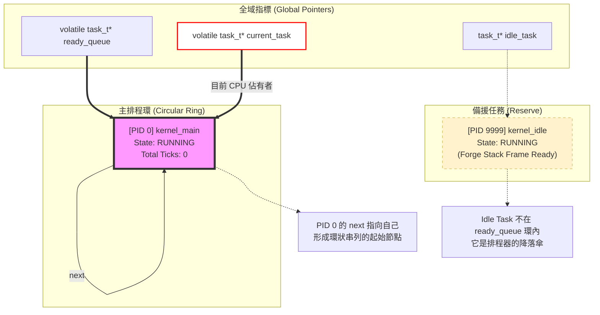

在 `init_multitasking()` 執行完畢後，系統的任務結構處於一個「過渡狀態」。此時 Kernel Main (PID 0) 剛拿到身分證，而 Idle Task (PID 9999) 則是在場邊預備的狀態。

這張圖展示了兩者在記憶體中的關係以及它們目前的執行狀態。

### 結構與狀態深度分析：

1.  **PID 0 的「自我循環」**：
    在 `init_multitasking` 剛結束時，環裡面只有 PID 0。因此 `main_task->next = main_task`。這非常重要，因為這保證了當下一次 `timer_interrupt` 觸發 `schedule()` 時，排程器去存取 `current_task->next` 不會發生 `NULL pointer dereference`。

2.  **Idle Task 的「場外備戰」**：
    Idle Task 此時的狀態雖然是 `TASK_RUNNING`，但它**不在** `ready_queue` 指向的鏈結裡。它是一個孤島，只有當 `schedule()` 發現 `ready_queue` 繞了一圈都沒有其他任務可以跑時，才會強行把執行權交給它。

3.  **核心堆疊的差異**：
    * **PID 0**：`esp` 設為 0。這是因為 PID 0 現在「正在跑」，它的堆疊就是目前的核心堆疊。只有當它第一次被切換走時，`switch_task` 才會把當時的 `esp` 存入這個 `task_t`。
    * **PID 9999**：`esp` 指向一個剛被 `kmalloc` 出來的、由我們手工佈置過（Fake Frame）的堆疊。它在等待第一次被「甦醒」。

4.  **記憶體空間 (CR3)**：
    此時兩者的 `page_directory` 都指向同一塊核心頁目錄（Kernel Page Directory），因為這兩個任務目前都還是在 Ring 0 的核心空間中運作。

這就是 Simple OS 多工的起點：一個自我循環的領頭羊，和一個隨時待命的守衛。接下來，當你呼叫 `create_user_task` 時，新任務就會被插入到 PID 0 與 PID 0 之間，把這個小圓環慢慢撐大。
